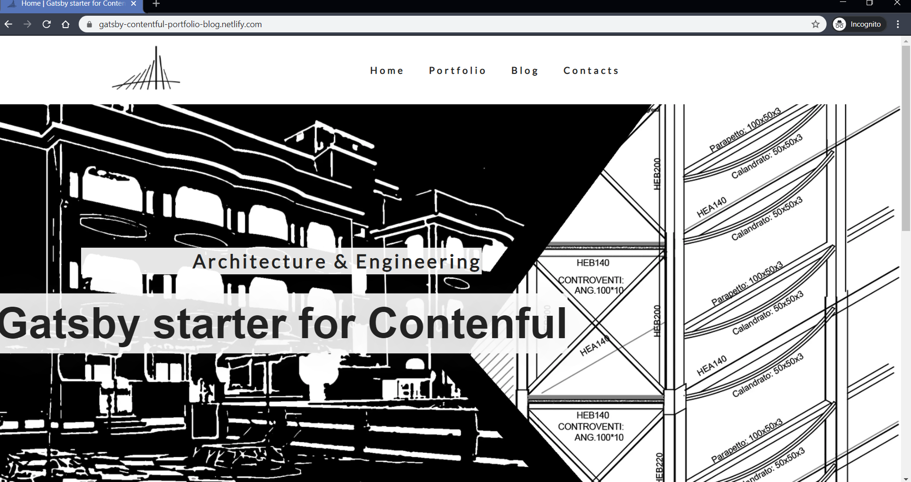

<p align="center">
  <a href="https://www.gatsbyjs.org">
    
  </a>
</p>
<h1 align="center">
  An architect portfolio built with Gatsby and Contentful: https://gatsby-contentful-portfolio-blog.netlify.com/
</h1>

This is a simple project built for a local architect. It shows its portfolio and also has a blog.

[](https://app.netlify.com/sites/studioassociatofusignani/deploys)
[](https://github.com/prettier/prettier)
[](https://github.com/ellerbrock/open-source-badge/)



## Features

- Gatsby
- Graphql
- Contenful
- Cypress
- CSS Modules and Styled Components
- PWA

### If this project helped you, please consider giving it a star! It would mean a lot to me :)

## 🚀 Quick start

1.  **Clone the repository**

    Use git to clone the repository.

    ```sh
    # clone the project using Git
    git clone https://github.com/escapemanuele/gatsby-contentful-blog-portfolio  your-project-name
    ```

2.  **Install the packages**

    Navigate into your new site’s directory and install the required packages.

    ```sh
    cd your-project-name
    npm install
    ```

3.  **Configure Contenful**

    Get yourself a [Contenful Account](https://www.contentful.com/), create a new space and configure this project to use it with:

    ```sh
    npm run setup
    ```

    You will need to add your spaceID and Content Delivery Token as environment variables to Netlify before you deploy<sup>1</sup>

4.  **Start developing.**

    Finally you are ready to see your project. Start the engine!

    ```sh
    gatsby develop
    ```

5.  **Open the source code and start editing!**

    Your site is now running at `http://localhost:8000`!

    Feel free to change everything you want!

6.  **Test the application with Cypress**

        There are some cypress tests defined in the 'cypress' folder.
        You only need to use
         ```sh
        npm run test:open:e2e
        ```

    &nbsp;

<sup>1</sup>The setup script writes your spaceID and Content Delivery Token to a .env file for local development. .env files are not pushed to remote git repos for security reasons. Thus you'll need to set the environment variables so Netlify can access Contentful. Your personal access token for the Content Management API is used to create the initial content types and is not saved.
